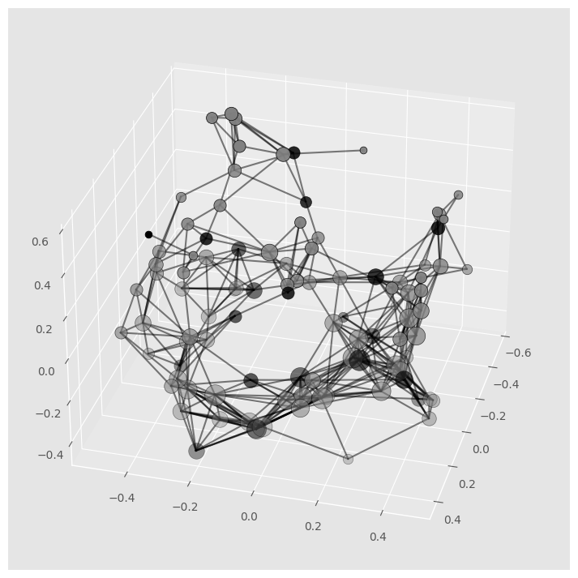
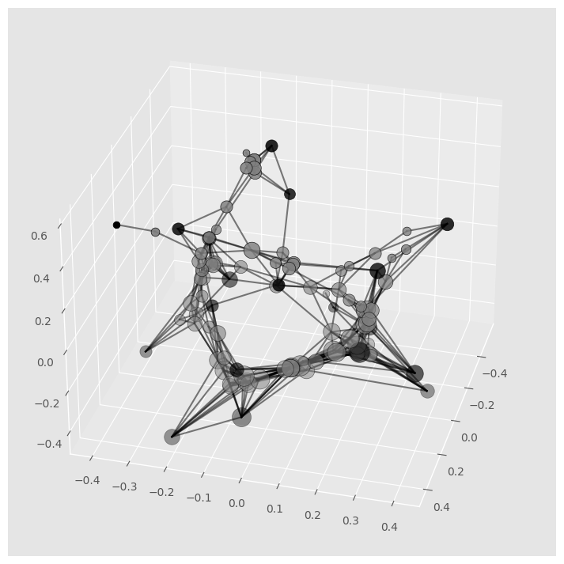

# Graph-Embedding

Graph embedding is an important problem in machine learning and graph theory. Given an undirected graph $G = (V, E)$ with $n$ vertices, the problem is to assign coordinates in $\mathbb{R}^m$ to each vertex $v \in V$. Typically there are desired qualities or constraints imposed on the embedding e.g. the coordinates assigned to connected nodes should be close with respect to some notion of distance. For example, the choice of Euclidean distance yields a quadratically constrained quadratic program (QCQP). Let $A \in \{0,1\}^{n\times n}$ be the symmetric adjacency of $G$, and let $D$ be the corresponding diagonal degree matrix such that $D_{ii} = \sum_{j}A_{i,j}$. The $\textit{graph Laplacian}$ is defined to be $L = D - A$.

One well-known way to do graph embedding (Laplacian Eigenmaps) is to solve the following problem:

$$\begin{equation}
\begin{aligned}
    &\min_{X \in \mathbb{R}^{n\times m}} \langle X, LX \rangle \\
    & \text{s.t. }X^\top X = I, \textbf{1}^\top X = 0
\end{aligned}
\end{equation}$$

Where the inner product $\langle A, B \rangle$ is defined to be $\text{tr}(A^\top B)$.

## Relaxation

The linear constraint may be eliminated resulting in the following relaxation

$$\begin{equation}
\begin{aligned}
    &\min_{X \in \mathbb{R}^{n\times m}} \langle X, \widetilde{L}X \rangle  \\
     & \text{s.t. } \langle X, X \rangle \leq r^2
\end{aligned}
\end{equation}$$

This can be shown as follows: Let P be the projection onto the orthogonal complement of the subspace spanned by $\textbf{1}$, i.e. $P = I − \frac{1}{n}\textbf{1}\textbf{1}^⊤$. Apply the substitution $X \leftarrow P X$. The objective can be re-written: $\langle P X, LP X \rangle = \langle X, P LP X \rangle = \langle X, \tilde{L}X \rangle$. $\tilde{L}$ is PSD. One issue with this formulation is that the relaxation admits a degenerate solution of X = 0.

## Semi-Supervised Modification

One way to condition the relaxation is to introduce additional constraints. Consider a "semi-supervised" modification of the original problem: where first $k$ vertices are "labeled" or "anchored" i.e. we have the constraints $X_i = y_i$ for $1,\ldots,k$, where $y_i \in \mathbb{R}^m$.

$$\begin{equation}
\begin{aligned}
    &\min_{X \in \mathbb{R}^{n\times m}} \langle X, \widetilde{L}X \rangle  \\
    & \text{s.t. } \langle X, X \rangle \leq r^2,\quad X_i = y_i, \ldots i = 1,\ldots, k
\end{aligned}
\end{equation}$$

Consider the partitioning 

$$ X = \begin{bmatrix}
    X_l \\
    X_u
\end{bmatrix}\ and\ \tilde L = \begin{bmatrix}
    \tilde L_{11} & \tilde L_{12} \\
    \tilde L_{21} & \tilde L_{22}
\end{bmatrix} $$

$$ => X^T \tilde L X = \begin{bmatrix}
    X_l^T & X_u^T
\end{bmatrix} \begin{bmatrix}
    \tilde L_{11} & \tilde L_{12} \\
    \tilde L_{21} & \tilde L_{22}
\end{bmatrix} \begin{bmatrix}
    X_l \\
    X_u
\end{bmatrix}$$

$$ => X^T \tilde L X = X_l^T \tilde L_{11} X_l + X_u^T \tilde L_{21} X_l + X_l^T \tilde L_{12} X_u + X_u^T \tilde L_{22} X_u $$

So, minimizing $X^T \tilde L X$ is the same as minimizing $X_l^T \tilde L_{11} X_l + X_u^T \tilde L_{21} X_l + X_l^T \tilde L_{12} X_u + X_u^T \tilde L_{22} X_u$.

$X_l^T \tilde L_{11} X_l$ can be removed from this objective because it is a constant. Hence the final minimization objective is $X_u^T \tilde L_{21} X_l + X_l^T \tilde L_{12} X_u + X_u^T \tilde L_{22} X_u$ which is equivalent to $\langle X_u, \tilde L_{21} X_l \rangle + \langle X_l, \tilde L_{12} X_u \rangle + \langle X_u, \tilde L_{22} X_u \rangle$.

$$ Similarly,\ X^T X = \begin{bmatrix}
    X_l^T & X_u^T
\end{bmatrix} \begin{bmatrix}
    X_l \\
    X_u
\end{bmatrix} $$

$$ => X^T X = X_l^T X_l + X_u^T X_u $$

$$ => X^T X \leq r^2 \rightarrow X_l^T X_l + X_u^T X_u \leq r^2 \rightarrow X_u^T X_u \leq r^2 - X_l^T X_l \rightarrow \langle X_u, X_u \rangle \leq r^2 - \langle X_l, X_l \rangle $$

### Associated optimization problem

$$ \begin{equation}
    \begin{aligned}
        &\min_{X_u \in \mathbb{R}^{n-k\times m}} \langle X_u, \tilde L_{21} X_l \rangle + \langle X_l, \tilde L_{12} X_u \rangle + \langle X_u, \tilde L_{22} X_u \rangle\\
        &subject\ to\ \langle X_u, X_u \rangle \leq r^2 - \langle X_l, X_l \rangle
    \end{aligned}
\end{equation} $$

### Derivation of Dual

Lagrangian = $\langle X_u, \tilde L_{21} X_l \rangle + \langle X_l, \tilde L_{12} X_u \rangle + \langle X_u, \tilde L_{22} X_u \rangle + \lambda (\langle X_u, X_u \rangle + \langle X_l, X_l \rangle - r^2)$

$g(\lambda) = \inf_{X_u} [\langle X_u, \tilde L_{21} X_l \rangle + \langle X_l, \tilde L_{12} X_u \rangle + \langle X_u, \tilde L_{22} X_u \rangle + \lambda (\langle X_u, X_u \rangle + \langle X_l, X_l \rangle - r^2)]$

Infinimum occurs when $\nabla_{X_u}\ Lagrangian = 0$

$=> \nabla_{X_u}\ Lagrangian = \tilde L_{21} X_l + (\tilde L_{12})^T X_l + (\tilde L_{22} + (\tilde L_{22})^T) X_u + 2\lambda X_u = 0$

$=> X_u = - (\tilde L_{22} + (\tilde L_{22})^T + 2\lambda I)^{-1} (\tilde L_{21} X_l + (\tilde L_{12})^T X_l)$

Let this value of $X_u$ be $\tilde X_u$. So, $g(\lambda) =$ Lagrangian at $\tilde X_u$ = $\langle \tilde X_u, \tilde L_{21} X_l \rangle + \langle X_l, \tilde L_{12} \tilde X_u \rangle + \langle \tilde X_u, \tilde L_{22} \tilde X_u \rangle + \lambda (\langle \tilde X_u, \tilde X_u \rangle + \langle X_l, X_l \rangle - r^2)$.

Then the dual problem is

$$\begin{equation}
    \begin{aligned}
        &Maximize\ \langle \tilde X_u, \tilde L_{21} X_l \rangle + \langle X_l, \tilde L_{12} \tilde X_u \rangle + \langle \tilde X_u, \tilde L_{22} \tilde X_u \rangle + \lambda (\langle \tilde X_u, \tilde X_u \rangle + \langle X_l, X_l \rangle - r^2)\\
        &subject\ to\ \lambda \geq 0
\end{aligned}
\end{equation}$$

## Visualization

Let $X \in R^{n×3}$ represent the coordinates of n vertices in 3-d. The vertex coordinate assignment can be visualized as a “drawing” of G.

The solution to the optimization problem derived in the previous section is shown below.

Below is an animation of the solution

https://github.com/aayushg97/Graph-Embedding/assets/30308551/0c6954ed-82c8-4623-8fe0-3405fedae92e

